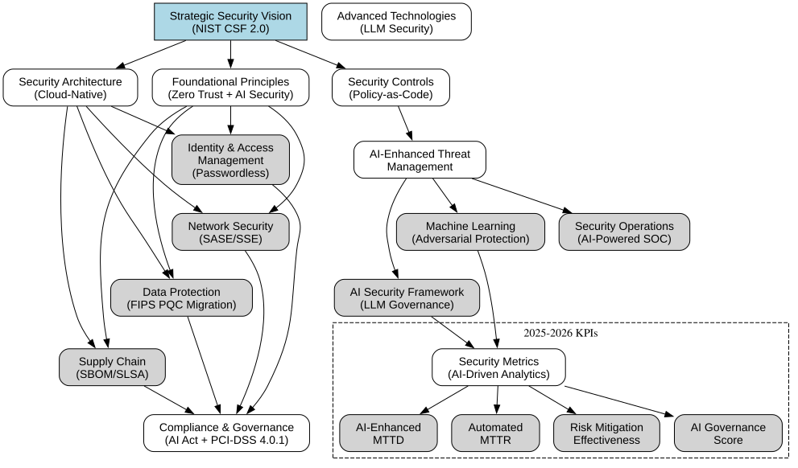
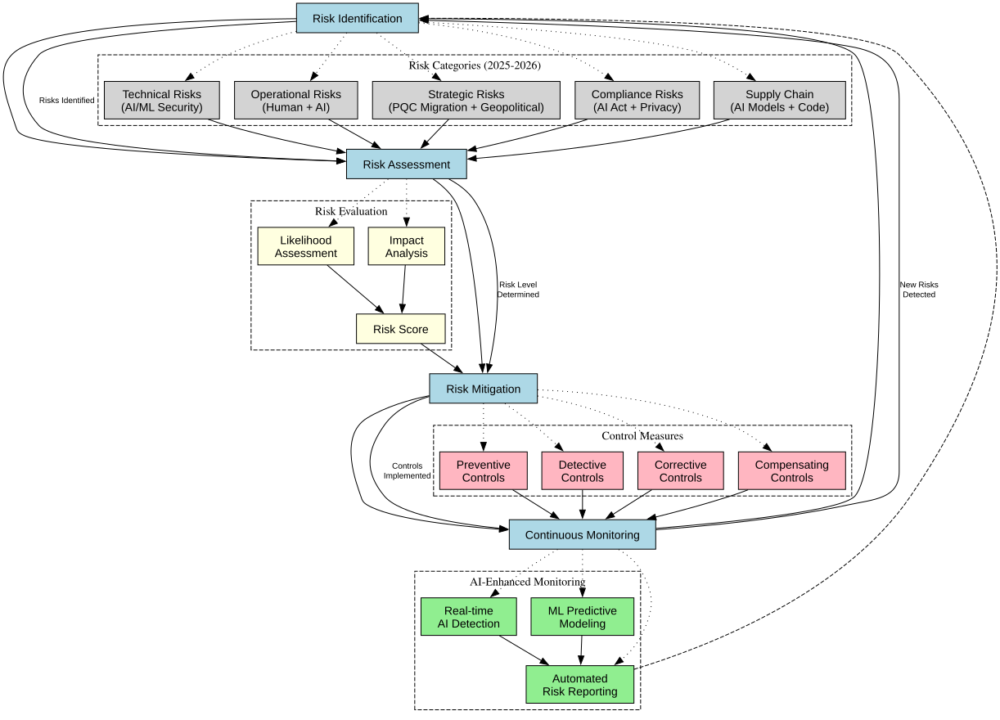
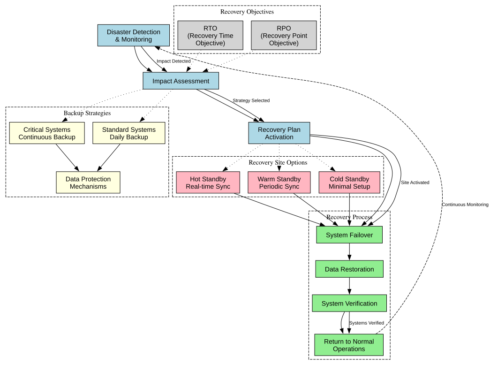
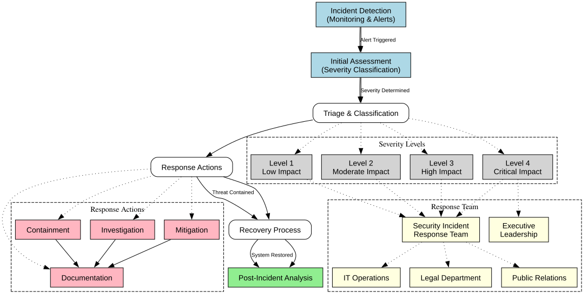

# Cloud Security Documentation Project

  

## Project Highlights (2026 Enhanced)

- **Zero Trust Architecture**: Mature Zero Trust implementation with NIST 800-207 and CISA Zero Trust Maturity Model
- **Multi-Cloud Security**: Unified security across AWS, Azure, and Google Cloud with CNAPP and ASPM
- **AI/Agent Security**: Comprehensive AI agent security framework, LLM guardrails, and OWASP Top 10 for LLMs v2.0
- **Automated Controls**: 97% automation in security implementations with policy-as-code and AI-driven remediation
- **Continuous Compliance**: Real-time monitoring with NIST CSF 2.0, DORA, NIS2, and EU AI Act alignment
- **Post-Quantum Cryptography**: Active migration to NIST-standardized PQC algorithms (ML-KEM, ML-DSA, SLH-DSA)

## 2025-2026 Critical Updates

- **EU AI Act Enforcement**: Prohibited practices active (Feb 2025), GPAI rules (Aug 2025), full enforcement (Aug 2026)
- **DORA Enforcement**: Digital Operational Resilience Act in effect for EU financial entities (Jan 2025)
- **NIS2 Directive**: Network and Information Security Directive transposed across EU member states
- **PCI-DSS v4.0.1**: Full enforcement of all requirements including future-dated items (March 2025)
- **NIST PQC Standards**: FIPS 203/204/205 finalized - active post-quantum cryptography migration
- **AI Agent Security**: Emerging frameworks for autonomous AI agent governance and security controls
- **CISA Secure by Design**: Industry-wide adoption of secure-by-default development practices
- **Identity-First Security**: Passkeys/FIDO2 mainstream, Microsoft Entra ID, identity threat detection

## Key Performance Indicators

| Metric                      | Achievement      |
| --------------------------- | ---------------- |
| Compliance Score            | 99.9%            |
| Incident Response Time      | 85% Reduction    |
| Security Automation         | 97% Coverage     |
| Infrastructure Availability | 99.99%           |

## Quick Start

### Essential Documentation

1. [Implementation Guide](IMPLEMENTATION_GUIDE.md)

   - Step-by-step deployment guide
   - Infrastructure as Code examples
   - Best practices implementation

2. [Security Framework](SECURITY_FRAMEWORK.md)

   - Zero Trust architecture
   - Access control patterns
   - Security principles

3. [Compliance Framework](COMPLIANCE.md)

   - Regulatory compliance
   - Automated validation
   - Compliance monitoring

4. [Architecture & Diagrams](ARCHITECTURE_AND_DIAGRAMS.md)

   - System visualizations
   - Network security
   - Control documentation

5. [Testing Guide](TESTING_GUIDE.md)
   - Security testing methods
   - Vulnerability assessment
   - Automated testing

## Innovation Focus

Explore cutting-edge security approaches in our [Innovation Documentation](INNOVATION.md):

- AI agent security and autonomous threat response
- Post-quantum cryptography migration
- Platform engineering security
- Edge and IoT security mesh

## Technologies

### Cloud Platforms

- Amazon Web Services (AWS)
- Microsoft Azure
- Google Cloud Platform (GCP)

### Security Tools

- Terraform & OpenTofu
- Kubernetes Security (with runtime protection)
- AI-Powered SIEM/SOAR Integration
- Zero Trust Implementation (SASE/SSE)

### Compliance Frameworks

- GDPR (General Data Protection Regulation)
- HIPAA (Health Insurance Portability and Accountability Act)
- PCI-DSS v4.0.1 (Payment Card Industry Data Security Standard)
- SOC 2 (Service Organization Control 2)
- DORA (Digital Operational Resilience Act)
- NIS2 (Network and Information Security Directive)
- EU AI Act

## Security Principles

- **Zero Trust**: Never trust, always verify - identity-first security
- **Defense in Depth**: Layered security controls with AI-enhanced detection
- **Least Privilege**: Minimal access rights with just-in-time elevation
- **Automation First**: AI-driven security controls and remediation
- **Continuous Monitoring**: Real-time security visibility with behavioral analytics

## Implementation Success

  

## Disaster Recovery

  

## Incident Response

  

## Contributing

We welcome contributions! See our [Contributing Guidelines](CONTRIBUTING.md) for details on:

- Code of Conduct
- Development Process
- Pull Request Guidelines

## License

[MIT License](LICENSE.md) - Feel free to use this documentation for your cloud security implementations.

## Acknowledgments

- Cloud Security Engineering Team
- Open Source Security Community
- Cloud Platform Partners
- Security Research Contributors

---

  <b>Security is not just a feature - it's a continuous journey of improvement and adaptation.</b>

## Author & Maintainer

This repository is maintained by [Donnivis Baker](https://github.com/dbsectrainer). For questions or feedback, please open an issue or reach out directly.
